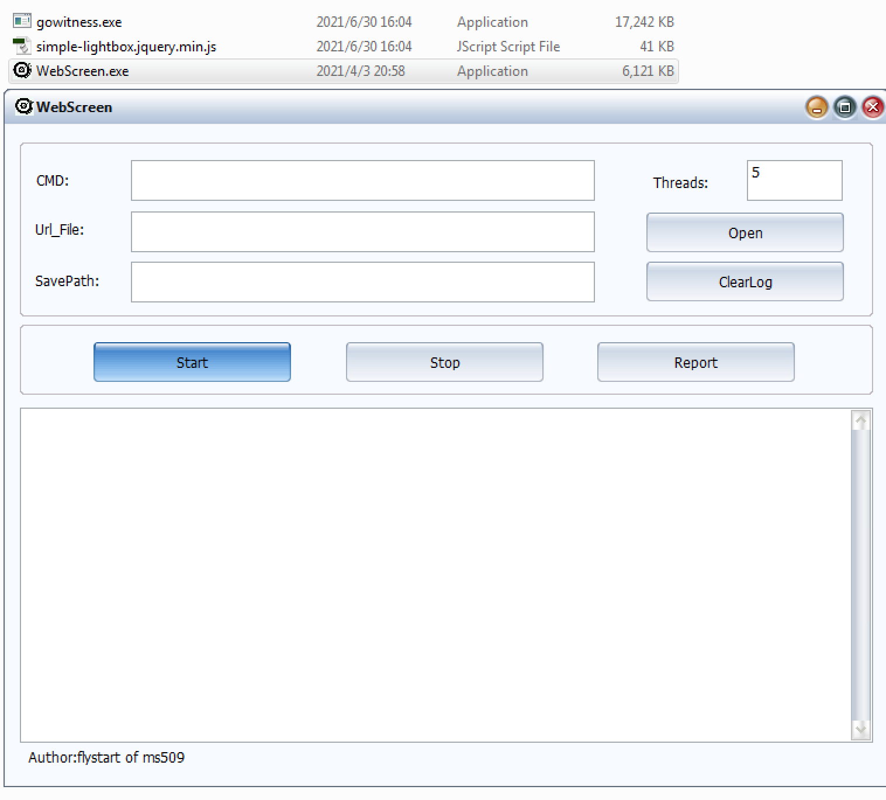
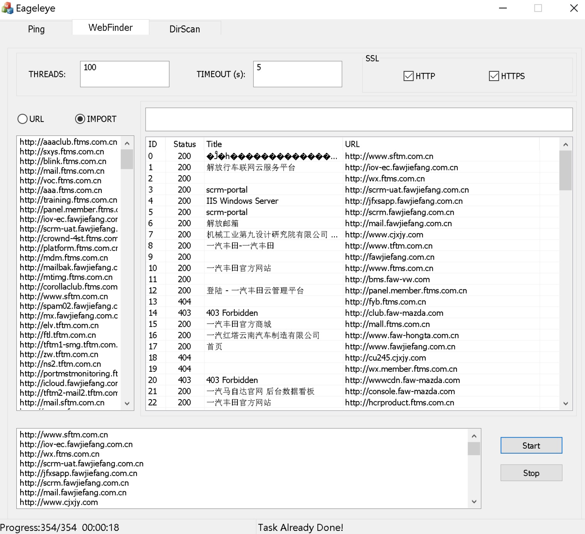
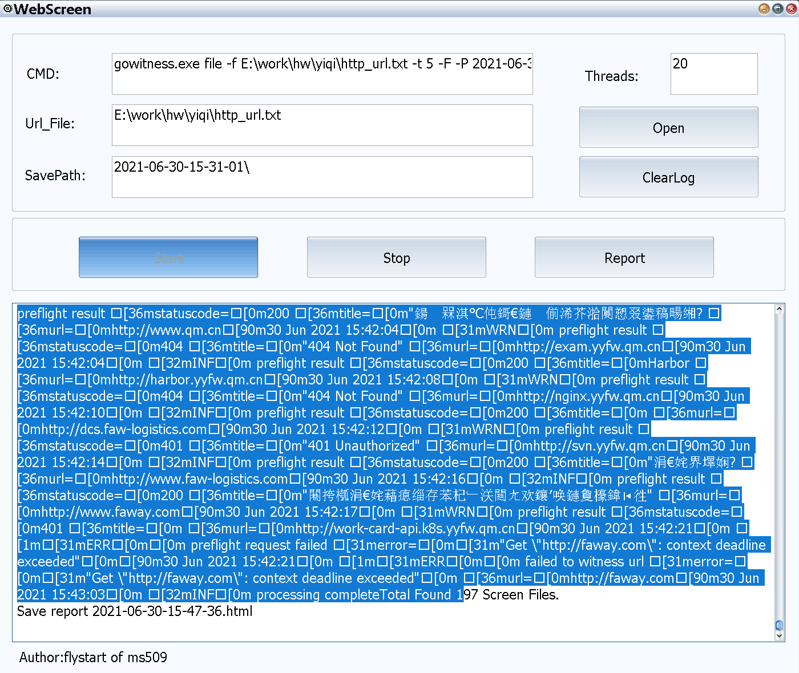
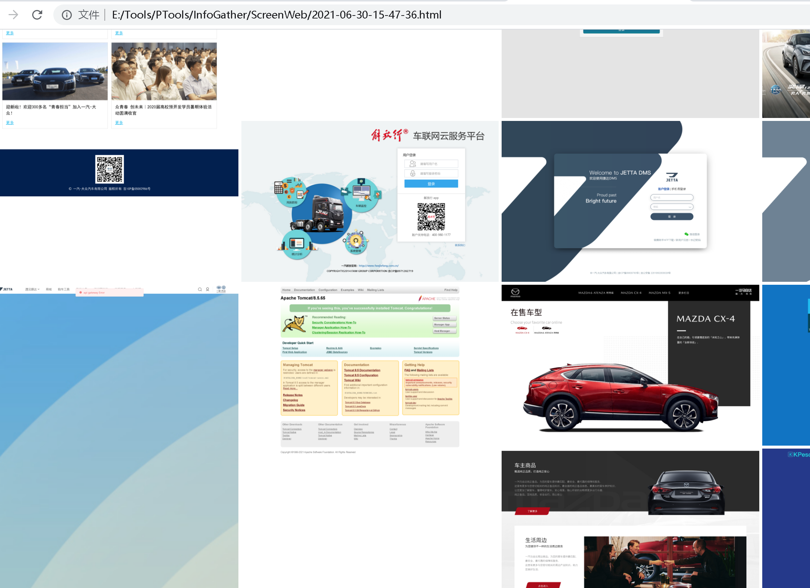

# 介绍

WebScreen  是一款网站快照工具，方便渗透的时候更快捷快速的挑选目标进行测试。使用了gowitness 作为截图引擎，添加了生成html报告功能，照片会以照片墙的形式展示。截图完成之后需要手动点击Report,可以设置SavePath 为其他网站截图工具生成的快照文件夹PS：）本人调研了很多网站快照工具,gowitness是我用过的最好没有之一.

**md5**:  79e07a206c07bef15a5b25e430c37b5d

**hash1** : c1ac1fe7d0b70b365fce492711a05c7300e8b9a0

**crc32**: 47042458

# 原理：

 工具内嵌了gotwitness和Lightbox,运行的时候会自动释放这两个文件，释放之前会检测根目录是否存在，所以用户可以更新gowitness为最新版本。给大批量目标进行快照之前最好使用httpx 等工具筛选一下存活目标节约时间。

# 使用：

1. 探测存活web
2. 导入目标 Start screen
3. Report html 筛选渗透目标

## Good luck ! 